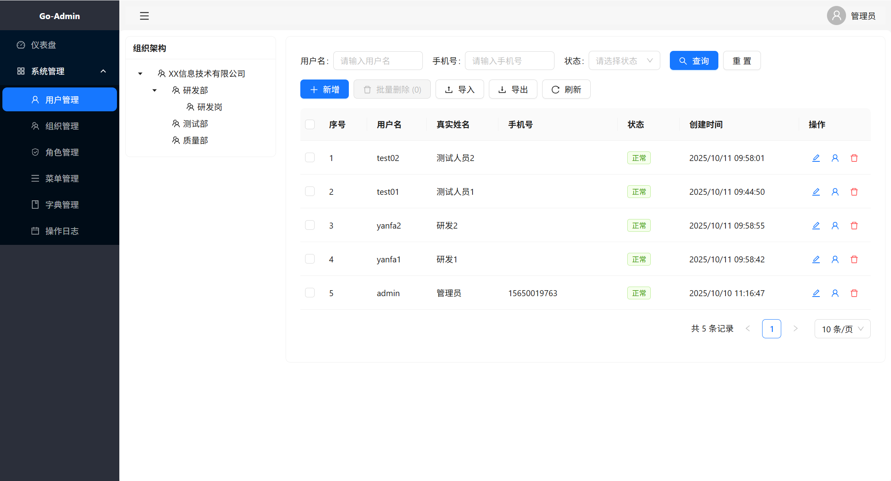
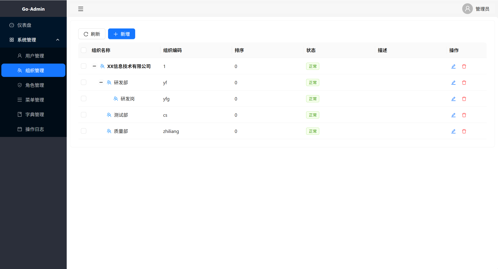
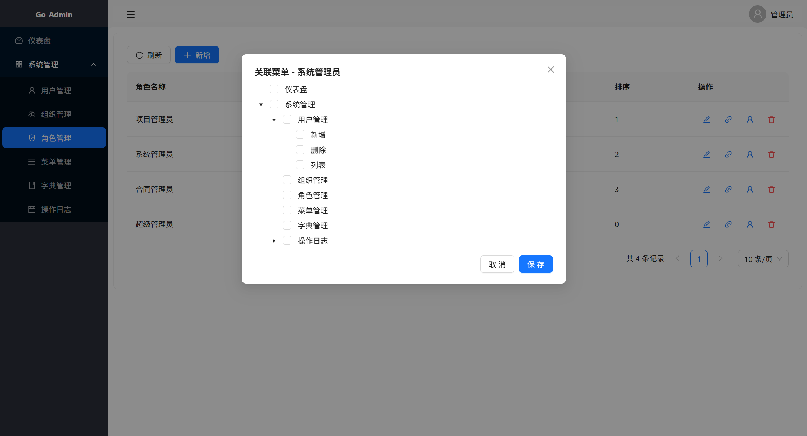
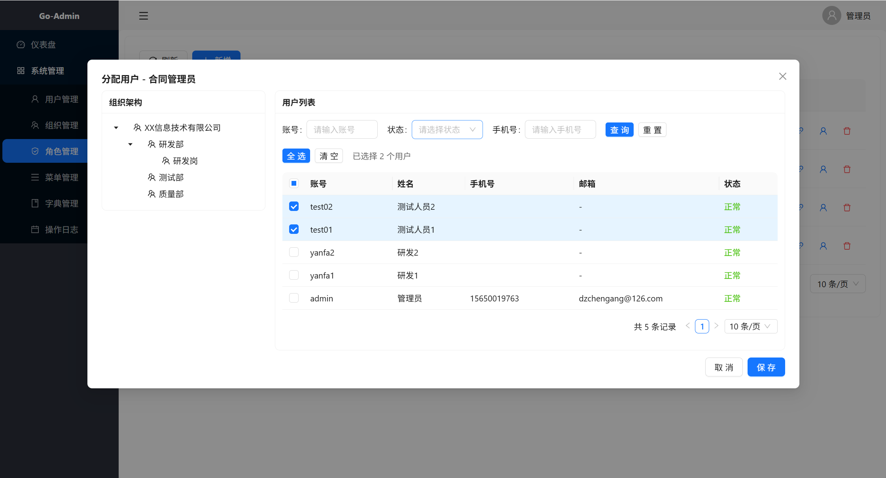
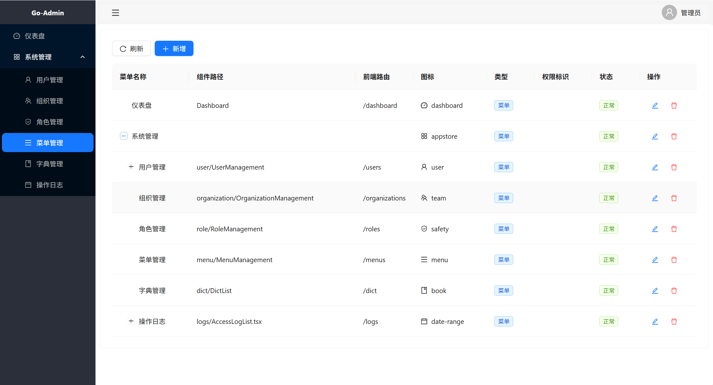
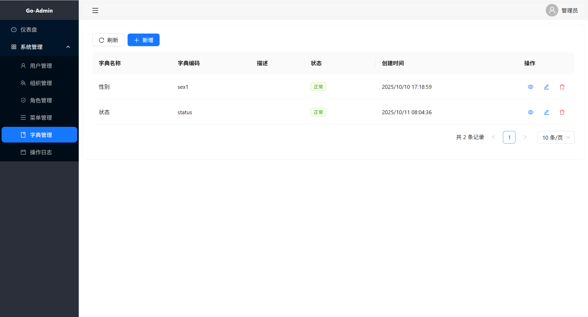
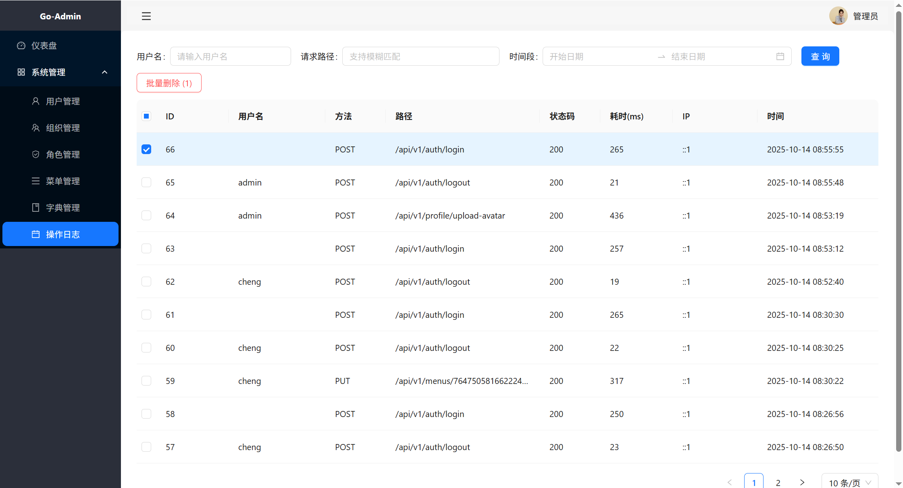
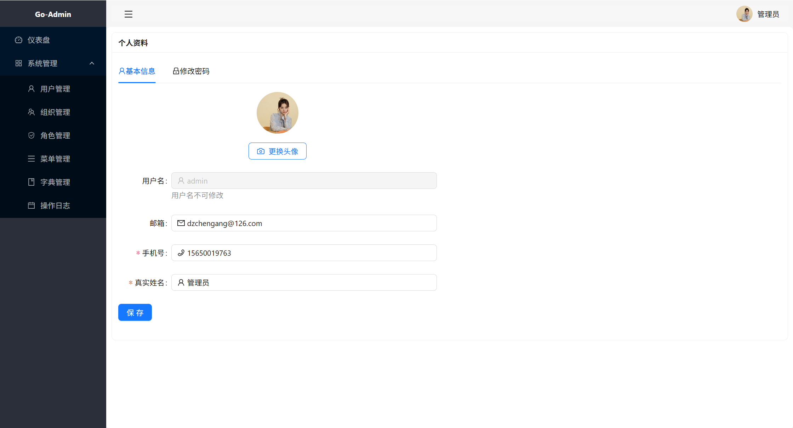

# Go-Admin 开发框架

基于 React + Go + PostgreSQL + Redis 的现代化管理系统开发框架

## 🚀 技术栈

### 后端

- **Go 1.21+** - 主要后端语言
- **Gin** - Web框架
- **GORM** - ORM框架
- **PostgreSQL** - 主数据库
- **Redis** - 缓存和会话存储
- **JWT** - 身份认证
- **Viper** - 配置管理

### 前端

- **React 18** - 前端框架
- **TypeScript** - 类型安全
- **Ant Design** - UI组件库
- **React Router** - 路由管理
- **Axios** - HTTP客户端
- **Zustand** - 状态管理

## 📋 功能模块

### 系统管理模块 (sys/)

- ✅ **用户管理** - 用户CRUD、状态管理、角色分配
- ✅ **组织管理** - 树形组织结构、层级管理
- ✅ **角色管理** - 角色定义、权限分配
- ✅ **菜单管理** - 动态菜单、权限控制
- ✅ **字典管理** - 系统字典、数据字典项

### 认证模块 (auth/)

- ✅ **用户认证** - JWT令牌认证
- ✅ **权限控制** - 基于角色的访问控制
- ✅ **会话管理** - Redis会话存储

## 🏗️ 项目结构

```
go-admin/
├── backend/                 # Go后端
│   ├── cmd/                # 应用入口
│   │   └── main.go
│   ├── internal/           # 内部包
│   │   ├── api/           # API层
│   │   ├── config/        # 配置管理
│   │   ├── database/      # 数据库连接
│   │   ├── middleware/    # 中间件
│   │   ├── router/        # 路由配置
│   │   ├── service/       # 业务逻辑层
│   │   ├── sys/          # 系统管理模块
│   │   │   ├── api/       # 系统管理API
│   │   │   ├── model/     # 数据模型
│   │   │   └── service/   # 业务逻辑
│   │   └── utils/         # 工具函数
│   ├── config.yaml        # 配置文件
│   ├── Dockerfile
│   ├── go.mod
│   └── go.sum
├── frontend/              # React前端
│   ├── src/
│   │   ├── components/    # 公共组件
│   │   ├── pages/         # 页面组件
│   │   ├── services/      # API服务
│   │   ├── store/         # 状态管理
│   │   ├── router/        # 路由配置
│   │   ├── hooks/         # 自定义Hooks
│   │   └── utils/         # 工具函数
│   ├── package.json
│   └── Dockerfile
└── README.md
```

## 🚀 快速开始

### 环境要求

- Go 1.21+
- Node.js 18+
- Docker & Docker Compose
- Git

### 配置文件

项目配置文件位于 `backend/config.yaml`：

```yaml
server:
  port: "8080"        # 服务器端口
  mode: "debug"       # 运行模式

database:
  host: "localhost"   # 数据库主机
  port: 5432          # 数据库端口
  user: "postgres"    # 数据库用户名
  password: "password" # 数据库密码
  dbname: "go_admin"  # 数据库名称
  sslmode: "disable"  # SSL模式

redis:
  host: "localhost"   # Redis主机
  port: 6379         # Redis端口
  password: ""       # Redis密码
  db: 0             # Redis数据库

jwt:
  secret: "your-secret-key" # JWT密钥
  expire_time: 24           # 过期时间(小时)
```

### 启动项目

```bash
# 1. 启动数据库和Redis
docker-compose up -d postgres redis

# 2. 启动后端
cd backend
go mod tidy
go run cmd/main.go

# 3. 启动前端
cd frontend
npm install
npm start
```

### 访问地址

- **前端**: http://localhost:3000
- **后端API**: http://localhost:8080
- **默认账户**: admin / admin123

## 🛠️ 新功能开发指南

### 完整开发流程：从后端到前端

以添加"产品管理"模块为例，展示完整的开发流程：

#### 1. 后端开发

**步骤1：创建数据模型**

```go
// backend/internal/sys/model/product.go
package model

import (
    "time"
    "gorm.io/gorm"
)

type Product struct {
    ID          uint           `json:"id" gorm:"primaryKey"`
    Name        string         `json:"name" gorm:"not null" binding:"required"`
    Code        string         `json:"code" gorm:"uniqueIndex;not null" binding:"required"`
    Price       float64        `json:"price" gorm:"not null"`
    Category    string         `json:"category"`
    Status      int            `json:"status" gorm:"default:1"` // 1:正常 0:禁用
    Description string         `json:"description"`
    CreatedAt   time.Time      `json:"created_at"`
    UpdatedAt   time.Time      `json:"updated_at"`
    DeletedAt   gorm.DeletedAt `json:"-" gorm:"index"`
}

func (Product) TableName() string {
    return "sys_products"
}
```

**步骤2：创建业务逻辑层**

```go
// backend/internal/sys/service/product.go
package service

import (
    "go-admin/internal/sys/model"
    "gorm.io/gorm"
)

type ProductService struct {
    db *gorm.DB
}

func NewProductService(db *gorm.DB) *ProductService {
    return &ProductService{db: db}
}

func (s *ProductService) CreateProduct(product *model.Product) error {
    return s.db.Create(product).Error
}

func (s *ProductService) GetProductByID(id uint) (*model.Product, error) {
    var product model.Product
    err := s.db.First(&product, id).Error
    return &product, err
}

func (s *ProductService) UpdateProduct(product *model.Product) error {
    return s.db.Save(product).Error
}

func (s *ProductService) DeleteProduct(id uint) error {
    return s.db.Delete(&model.Product{}, id).Error
}

func (s *ProductService) ListProducts(page, pageSize int) ([]model.Product, int64, error) {
    var products []model.Product
    var total int64

    offset := (page - 1) * pageSize

    err := s.db.Model(&model.Product{}).Count(&total).Error
    if err != nil {
        return nil, 0, err
    }

    err = s.db.Offset(offset).Limit(pageSize).Find(&products).Error
    return products, total, err
}
```

**步骤3：创建API层**

```go
// backend/internal/sys/api/product.go
package api

import (
    "go-admin/internal/sys/model"
    "go-admin/internal/sys/service"
    "net/http"
    "strconv"
    "github.com/gin-gonic/gin"
)

type ProductHandler struct {
    productService *service.ProductService
}

func NewProductHandler(productService *service.ProductService) *ProductHandler {
    return &ProductHandler{productService: productService}
}

type CreateProductRequest struct {
    Name        string  `json:"name" binding:"required"`
    Code        string  `json:"code" binding:"required"`
    Price       float64 `json:"price" binding:"required"`
    Category    string  `json:"category"`
    Status      int     `json:"status"`
    Description string  `json:"description"`
}

func (h *ProductHandler) CreateProduct(c *gin.Context) {
    var req CreateProductRequest
    if err := c.ShouldBindJSON(&req); err != nil {
        c.JSON(http.StatusBadRequest, gin.H{"error": err.Error()})
        return
    }

    product := &model.Product{
        Name:        req.Name,
        Code:        req.Code,
        Price:       req.Price,
        Category:    req.Category,
        Status:      req.Status,
        Description: req.Description,
    }

    if err := h.productService.CreateProduct(product); err != nil {
        c.JSON(http.StatusBadRequest, gin.H{"error": err.Error()})
        return
    }

    c.JSON(http.StatusCreated, gin.H{"message": "产品创建成功", "product": product})
}

func (h *ProductHandler) GetProduct(c *gin.Context) {
    id, err := strconv.ParseUint(c.Param("id"), 10, 32)
    if err != nil {
        c.JSON(http.StatusBadRequest, gin.H{"error": "无效的产品ID"})
        return
    }

    product, err := h.productService.GetProductByID(uint(id))
    if err != nil {
        c.JSON(http.StatusNotFound, gin.H{"error": "产品不存在"})
        return
    }

    c.JSON(http.StatusOK, product)
}

func (h *ProductHandler) ListProducts(c *gin.Context) {
    page, _ := strconv.Atoi(c.DefaultQuery("page", "1"))
    pageSize, _ := strconv.Atoi(c.DefaultQuery("page_size", "10"))

    products, total, err := h.productService.ListProducts(page, pageSize)
    if err != nil {
        c.JSON(http.StatusInternalServerError, gin.H{"error": "获取产品列表失败"})
        return
    }

    c.JSON(http.StatusOK, gin.H{
        "products":  products,
        "total":     total,
        "page":      page,
        "page_size": pageSize,
    })
}

func (h *ProductHandler) UpdateProduct(c *gin.Context) {
    id, err := strconv.ParseUint(c.Param("id"), 10, 32)
    if err != nil {
        c.JSON(http.StatusBadRequest, gin.H{"error": "无效的产品ID"})
        return
    }

    var req CreateProductRequest
    if err := c.ShouldBindJSON(&req); err != nil {
        c.JSON(http.StatusBadRequest, gin.H{"error": err.Error()})
        return
    }

    product, err := h.productService.GetProductByID(uint(id))
    if err != nil {
        c.JSON(http.StatusNotFound, gin.H{"error": "产品不存在"})
        return
    }

    product.Name = req.Name
    product.Code = req.Code
    product.Price = req.Price
    product.Category = req.Category
    product.Status = req.Status
    product.Description = req.Description

    if err := h.productService.UpdateProduct(product); err != nil {
        c.JSON(http.StatusInternalServerError, gin.H{"error": "更新失败"})
        return
    }

    c.JSON(http.StatusOK, gin.H{"message": "更新成功", "product": product})
}

func (h *ProductHandler) DeleteProduct(c *gin.Context) {
    id, err := strconv.ParseUint(c.Param("id"), 10, 32)
    if err != nil {
        c.JSON(http.StatusBadRequest, gin.H{"error": "无效的产品ID"})
        return
    }

    if err := h.productService.DeleteProduct(uint(id)); err != nil {
        c.JSON(http.StatusInternalServerError, gin.H{"error": "删除失败"})
        return
    }

    c.JSON(http.StatusOK, gin.H{"message": "删除成功"})
}
```

**步骤4：注册路由**

```go
// backend/internal/router/router.go
// 在路由配置中添加产品管理路由
func SetupRoutes(r *gin.Engine, db *gorm.DB, rdb *redis.Client) {
    // ... 其他路由配置

    // 产品管理
    productService := sysservice.NewProductService(db)
    productHandler := sysapi.NewProductHandler(productService)

    products := authorized.Group("/products")
    {
        products.POST("", productHandler.CreateProduct)
        products.GET("", productHandler.ListProducts)
        products.GET("/:id", productHandler.GetProduct)
        products.PUT("/:id", productHandler.UpdateProduct)
        products.DELETE("/:id", productHandler.DeleteProduct)
    }
}
```

#### 2. 前端开发

**步骤1：创建API服务**

```typescript
// frontend/src/services/product.ts
import api from './api';

export interface Product {
  id: number;
  name: string;
  code: string;
  price: number;
  category: string;
  status: number;
  description: string;
  created_at: string;
  updated_at: string;
}

export interface CreateProductRequest {
  name: string;
  code: string;
  price: number;
  category: string;
  status: number;
  description: string;
}

export interface ProductListResponse {
  products: Product[];
  total: number;
  page: number;
  page_size: number;
}

export const productService = {
  getProducts: async (page = 1, pageSize = 10): Promise<ProductListResponse> => {
    const response = await api.get('/products', {
      params: { page, page_size: pageSize }
    });
    return response.data;
  },

  getProduct: async (id: string): Promise<Product> => {
    const response = await api.get(`/products/${id}`);
    return response.data;
  },

  createProduct: async (data: CreateProductRequest): Promise<Product> => {
    const response = await api.post('/products', data);
    return response.data.product;
  },

  updateProduct: async (id: string, data: CreateProductRequest): Promise<Product> => {
    const response = await api.put(`/products/${id}`, data);
    return response.data.product;
  },

  deleteProduct: async (id: string): Promise<void> => {
    await api.delete(`/products/${id}`);
  },
};
```

**步骤2：创建页面组件**

```typescript
// frontend/src/pages/product/ProductManagement.tsx
import React, { useState, useEffect } from 'react';
import { Card, Table, Button, Space, Tag, message, Popconfirm, Modal, Form, Input, InputNumber, Select } from 'antd';
import { PlusOutlined, EditOutlined, DeleteOutlined, ReloadOutlined } from '@ant-design/icons';
import { productService, Product, CreateProductRequest } from '../../services/product';

const ProductManagement: React.FC = () => {
  const [products, setProducts] = useState<Product[]>([]);
  const [loading, setLoading] = useState(false);
  const [createVisible, setCreateVisible] = useState(false);
  const [editVisible, setEditVisible] = useState(false);
  const [editingProduct, setEditingProduct] = useState<Product | null>(null);
  const [form] = Form.useForm<CreateProductRequest>();
  const [editForm] = Form.useForm<CreateProductRequest>();

  // 加载产品列表
  const loadProducts = async () => {
    setLoading(true);
    try {
      const data = await productService.getProducts();
      setProducts(data.products);
    } catch (error) {
      message.error('加载产品列表失败');
    } finally {
      setLoading(false);
    }
  };

  useEffect(() => {
    loadProducts();
  }, []);

  // 打开新增弹窗
  const openCreateModal = () => {
    form.resetFields();
    form.setFieldsValue({ status: 1 });
    setCreateVisible(true);
  };

  // 提交新增
  const handleCreate = async () => {
    try {
      const values = await form.validateFields();
      await productService.createProduct(values);
      message.success('创建成功');
      setCreateVisible(false);
      loadProducts();
    } catch (error: any) {
      if (error?.errorFields) return;
      message.error(error?.response?.data?.error || '创建失败');
    }
  };

  // 打开编辑弹窗
  const openEditModal = (product: Product) => {
    setEditingProduct(product);
    editForm.setFieldsValue({
      name: product.name,
      code: product.code,
      price: product.price,
      category: product.category,
      status: product.status,
      description: product.description,
    });
    setEditVisible(true);
  };

  // 提交编辑
  const handleEdit = async () => {
    if (!editingProduct) return;
    try {
      const values = await editForm.validateFields();
      await productService.updateProduct(editingProduct.id.toString(), values);
      message.success('更新成功');
      setEditVisible(false);
      loadProducts();
    } catch (error: any) {
      if (error?.errorFields) return;
      message.error(error?.response?.data?.error || '更新失败');
    }
  };

  // 删除产品
  const handleDelete = async (id: string) => {
    try {
      await productService.deleteProduct(id);
      message.success('删除成功');
      loadProducts();
    } catch (error: any) {
      message.error(error?.response?.data?.error || '删除失败');
    }
  };

  const columns = [
    {
      title: '产品名称',
      dataIndex: 'name',
      key: 'name',
    },
    {
      title: '产品编码',
      dataIndex: 'code',
      key: 'code',
    },
    {
      title: '价格',
      dataIndex: 'price',
      key: 'price',
      render: (price: number) => `¥${price.toFixed(2)}`,
    },
    {
      title: '分类',
      dataIndex: 'category',
      key: 'category',
    },
    {
      title: '状态',
      dataIndex: 'status',
      key: 'status',
      render: (status: number) => (
        <Tag color={status === 1 ? 'green' : 'red'}>
          {status === 1 ? '正常' : '禁用'}
        </Tag>
      ),
    },
    {
      title: '操作',
      key: 'action',
      render: (_, record: Product) => (
        <Space>
          <Button
            type="link"
            icon={<EditOutlined />}
            onClick={() => openEditModal(record)}
          >
            编辑
          </Button>
          <Popconfirm
            title="确定要删除这个产品吗？"
            onConfirm={() => handleDelete(record.id.toString())}
            okText="确定"
            cancelText="取消"
          >
            <Button type="link" danger icon={<DeleteOutlined />}>
              删除
            </Button>
          </Popconfirm>
        </Space>
      ),
    },
  ];

  return (
    <Card title="产品管理">
      <div style={{ marginBottom: 16 }}>
        <Space>
          <Button type="primary" icon={<PlusOutlined />} onClick={openCreateModal}>
            新增产品
          </Button>
          <Button icon={<ReloadOutlined />} onClick={loadProducts}>
            刷新
          </Button>
        </Space>
      </div>

      <Table
        columns={columns}
        dataSource={products}
        rowKey="id"
        loading={loading}
        pagination={{
          showSizeChanger: true,
          showQuickJumper: true,
          showTotal: (total) => `共 ${total} 条记录`,
        }}
      />

      {/* 新增弹窗 */}
      <Modal
        title="新增产品"
        open={createVisible}
        onOk={handleCreate}
        onCancel={() => setCreateVisible(false)}
        okText="确定"
        cancelText="取消"
      >
        <Form form={form} layout="vertical">
          <Form.Item name="name" label="产品名称" rules={[{ required: true, message: '请输入产品名称' }]}>
            <Input placeholder="请输入产品名称" />
          </Form.Item>
          <Form.Item name="code" label="产品编码" rules={[{ required: true, message: '请输入产品编码' }]}>
            <Input placeholder="请输入产品编码" />
          </Form.Item>
          <Form.Item name="price" label="价格" rules={[{ required: true, message: '请输入价格' }]}>
            <InputNumber placeholder="请输入价格" style={{ width: '100%' }} min={0} />
          </Form.Item>
          <Form.Item name="category" label="分类">
            <Input placeholder="请输入分类" />
          </Form.Item>
          <Form.Item name="status" label="状态">
            <Select>
              <Select.Option value={1}>正常</Select.Option>
              <Select.Option value={0}>禁用</Select.Option>
            </Select>
          </Form.Item>
          <Form.Item name="description" label="描述">
            <Input.TextArea placeholder="请输入描述" rows={3} />
          </Form.Item>
        </Form>
      </Modal>

      {/* 编辑弹窗 */}
      <Modal
        title="编辑产品"
        open={editVisible}
        onOk={handleEdit}
        onCancel={() => setEditVisible(false)}
        okText="确定"
        cancelText="取消"
      >
        <Form form={editForm} layout="vertical">
          <Form.Item name="name" label="产品名称" rules={[{ required: true, message: '请输入产品名称' }]}>
            <Input placeholder="请输入产品名称" />
          </Form.Item>
          <Form.Item name="code" label="产品编码" rules={[{ required: true, message: '请输入产品编码' }]}>
            <Input placeholder="请输入产品编码" />
          </Form.Item>
          <Form.Item name="price" label="价格" rules={[{ required: true, message: '请输入价格' }]}>
            <InputNumber placeholder="请输入价格" style={{ width: '100%' }} min={0} />
          </Form.Item>
          <Form.Item name="category" label="分类">
            <Input placeholder="请输入分类" />
          </Form.Item>
          <Form.Item name="status" label="状态">
            <Select>
              <Select.Option value={1}>正常</Select.Option>
              <Select.Option value={0}>禁用</Select.Option>
            </Select>
          </Form.Item>
          <Form.Item name="description" label="描述">
            <Input.TextArea placeholder="请输入描述" rows={3} />
          </Form.Item>
        </Form>
      </Modal>
    </Card>
  );
};

export default ProductManagement;
```

**步骤3：添加路由**

在菜单管理配置菜单并赋给角色，重新登录后即可访问

## 🔐 权限控制使用指南

### 后端权限控制

**1. 中间件权限控制**

```go
// 在路由中使用权限中间件
users.GET("", middleware.AuthMiddleware(rdb, []string{"user:list"}), userHandler.ListUsers)
users.POST("", middleware.AuthMiddleware(rdb, []string{"user:create"}), userHandler.CreateUser)
users.PUT("/:id", middleware.AuthMiddleware(rdb, []string{"user:update"}), userHandler.UpdateUser)
users.DELETE("/:id", middleware.AuthMiddleware(rdb, []string{"user:delete"}), userHandler.DeleteUser)
```

**2. 权限标识规范**

- 格式：`模块:操作`
- 示例：`user:list`、`user:create`、`user:update`、`user:delete`
- 菜单权限：`user:menu`

### 前端权限控制

```typescript
// 在组件中使用权限控制
import { usePermission } from '../utils/permission';

const UserManagement: React.FC = () => {
  const canCreate = usePermission('user:create');
  const canUpdate = usePermission('user:update');
  const canDelete = usePermission('user:delete');

  return (
    <div>
      {canCreate && (
        <Button type="primary" onClick={handleCreate}>
          新增用户
        </Button>
      )}

      <Table
        columns={[
          // ... 其他列
          {
            title: '操作',
            render: (_, record) => (
              <Space>
                {canUpdate && (
                  <Button onClick={() => handleEdit(record)}>编辑</Button>
                )}
                {canDelete && (
                  <Button danger onClick={() => handleDelete(record)}>删除</Button>
                )}
              </Space>
            ),
          },
        ]}
      />
    </div>
  );
};
```

**3. 路由权限控制**

```typescript
// 在路由配置中使用权限控制
import { usePermission } from '../utils/permission';

const ProtectedRoute: React.FC<{ permission: string; children: React.ReactNode }> = ({
  permission,
  children,
}) => {
  const hasPermission = usePermission(permission);

  if (!hasPermission) {
    return <div>无权限访问</div>;
  }

  return <>{children}</>;
};

// 使用示例
<Route 
  path="/users" 
  element={
    <ProtectedRoute permission="user:menu">
      <UserManagement />
    </ProtectedRoute>
  } 
/>
```

### 前端字典使用

**1. 在组件中使用字典**

```typescript
// 使用字典数据
import { useDict } from '../hooks/useDict';
import { useDictStore } from '../store/dictStore';

const UserForm: React.FC = () => {
  // 方式1：使用Hook
  const { dictOptions: statusOptions } = useDict('user_status');

  // 方式2：直接从Store获取
  const { getDictOptions } = useDictStore();
  const genderOptions = getDictOptions('user_gender');

  return (
    <Form>
      <Form.Item name="status" label="状态">
        <Select options={statusOptions} placeholder="请选择状态" />
      </Form.Item>

      <Form.Item name="gender" label="性别">
        <Select options={genderOptions} placeholder="请选择性别" />
      </Form.Item>
    </Form>
  );
};
```


## 🧩 组件使用指南

### 1. OrganizationTree组件

```typescript
// 使用组织树组件
import OrganizationTree from '../components/OrganizationTree';

const MyComponent: React.FC = () => {
  const [selectedOrgId, setSelectedOrgId] = useState<string | null>(null);

  return (
    <OrganizationTree
      selectedOrgId={selectedOrgId}
      onSelect={setSelectedOrgId}
      defaultExpandAll={true}
      title="选择组织"
      size="default"
    />
  );
};
```

### 2. UserSelector组件

```typescript
// 使用用户选择器组件
import UserSelector from '../components/UserSelector';

const MyComponent: React.FC = () => {
  const [userSelectorVisible, setUserSelectorVisible] = useState(false);
  const [selectedUserKeys, setSelectedUserKeys] = useState<React.Key[]>([]);

  const handleUserSelect = (userIds: string[]) => {
    console.log('选中的用户ID:', userIds);
    setUserSelectorVisible(false);
  };

  return (
    <div>
      <Button onClick={() => setUserSelectorVisible(true)}>
        选择用户
      </Button>

      <UserSelector
        visible={userSelectorVisible}
        title="选择用户"
        selectedUserKeys={selectedUserKeys}
        onCancel={() => setUserSelectorVisible(false)}
        onOk={handleUserSelect}
      />
    </div>
  );
};
```

## 🖼️ 效果展示

### 系统界面展示

















## 📝 开发规范

### 代码规范

- 后端：遵循Go语言规范，使用gofmt格式化代码
- 前端：使用ESLint和Prettier进行代码格式化
- 提交信息：使用约定式提交规范

### 目录结构规范

- 后端：按功能模块组织代码，每个模块包含api、model、service
- 前端：按页面和组件组织代码，公共组件放在components目录

### 命名规范

- 后端：使用驼峰命名法，API路径使用小写和连字符
- 前端：使用PascalCase命名组件，camelCase命名变量和函数

## 📄 许可证

本项目采用Apache许可证 - 查看[LICENSE](LICENSE)文件了解详情。

**Go-Admin** - 让管理系统开发更简单、更高效！
